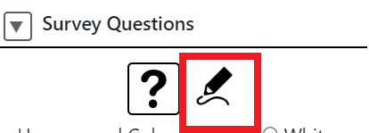
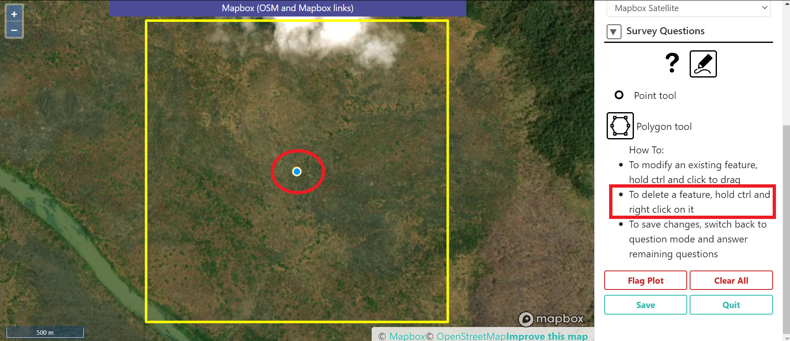
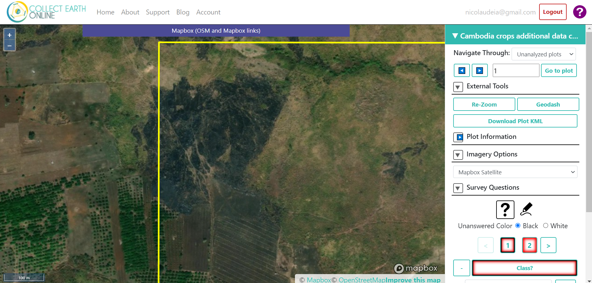
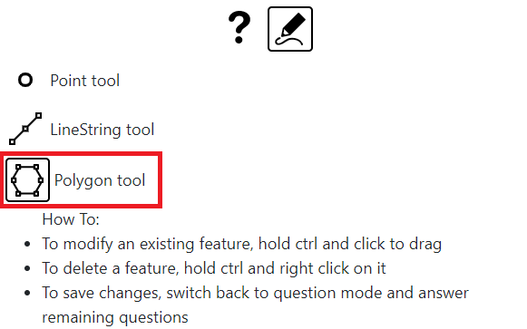
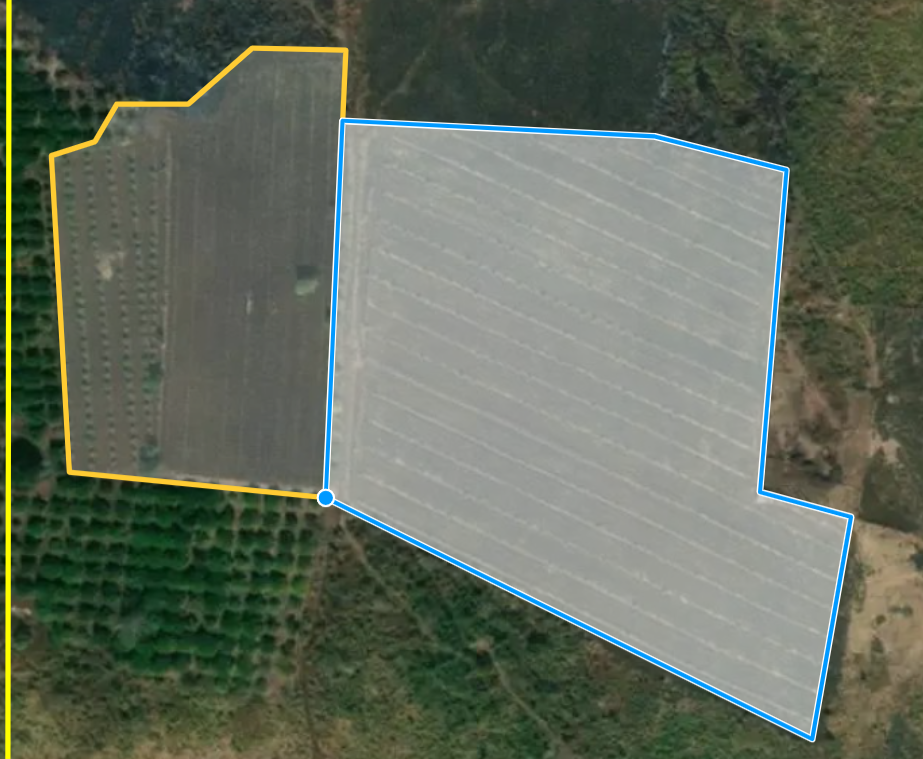

----------------------
Cashew data collection
----------------------

To be able to produce a cashew map, we need to collect more cashew and other crops data.

In the last data collection, we labeled data focused on broader classes (Broadleaf tree crops, Palm crops, Shrub crops, Annual crops). Now we will label the polygons as the specific crop types:

* For Broadleaf tree crops, label as: Cashew, Mango, Longan, Rambutan, Durian, Orange, etc
* For Palm crops, label as: Coconut, Oil Palm, Banana, Date Palm, etc
* For Shrub Crops, label as: Pepper, etc
* For Annual Crops, label as: Cassava, Maize, Bean, Rice, Sugarcane, Vegetables, etc

We will once again NOT collect data for the "Other" class (Water, Forest, Urban, Settlement, Grassland, etc). These will be filled in later. 

There is only one project in CEO for the collection. The project currently contains twenty five 4 by 4 km square patches (we can add more later if needed). These patches were created within 7 provinces: Kampong Thom, Preah Vihear, Mondulkiri, Kampong Speu, Ratanak kiri, Thbang khmom, and Siem Reap.

Getting Started
---------------

1. Login to `Collect Earth Online`_.

.. _Collect Earth Online: https://collect.earth

.. figure:: images/ceo.png

|

2. Go to the **Cambodia Crop Mapping** institution. You can look under "Your Affiliations" or search the institution using the search bar at the top. Click on **Visit** next to the institution.

.. figure:: images/visit.png

|

3. On the institution page, click on the project "KH Cashew data collection".

|

4. Go to the first plot to start the collection. 

|

Instructions for each plot
--------------------------

You will hand digitize polygons for the classes mentioned above. Every time you add a polygon using the proactive sampling tool, you will have to assign a class to it as shown below. You will also have the option to add any relevant notes regarding that polygon if you want to.

+---------------------+--------------------------------------------------------------+
|        Category     |                        Class (label)                         |
+---------------------+--------------------------------------------------------------+
| Broadleaf tree crop |     Cashew, Mango, Longan, Rambutan, Durian, Orange, etc     |
+---------------------+--------------------------------------------------------------+
|      Palm crop      |           Coconut, Oil Palm, Banana, Date Palm, etc          |
+---------------------+--------------------------------------------------------------+
|      Shrub crop     |                         Pepper, etc                          |
+---------------------+--------------------------------------------------------------+
|     Annual crop     |   Cassava, Maize, Bean, Rice, Sugarcane, Vegetables, etc     |
+---------------------+--------------------------------------------------------------+

You do not need to worry about the other Land covers (Settlement, Water body, Rubber, Forest cover, Grassland, Shrubland, Other), so do not collect polygons for these classes. We want to focus the time on the crops of interest only. 

Follow these instructions:

1. To start collecting the polygons, under "Survey Questions", click on the pencil icon below "Survey Questions".

|

- The instructions to edit the sample will show up. Read the instructions to make sure you understand them.

.. figure:: images/pencilinstruc.png
  
|

2. The first step here is to delete the point (CEO sample) from the center of the patch. To do this, hold CTRL and right click on the point

| 

3. Pick a corner or specific area to start.  E.g.: top left corner, or a contiguous patch of same crop (e.g. cashew field).

4. Add a new polygon to the respective area by selecting "Polygon tool" and using your mouse to draw it. Each click will place a vertice. 

| 

.. figure:: images/edit.png

|

.. figure:: images/edit2.png

|

.. note::

  Make sure you use the basemap imagery available in your project. We want to collect data from 2020, so primarily use the Planet mosaics from 2020 and the Maxar data (these images cover the period January 2020 to April 2021). Please note that the Maxar data has an offset of around 10 pixels, meaning that the pixels are a little misplaced compared to what is actually on the ground. For this reason, use the Maxar data just for reference, and rely on the Planet mosaics to do the digitization (actual drawing of the polygons). You can also use the Mapbox Satellite imagery for help but note that this basemap does not have a timestamp associated with it, so the images might not show what is actually on the ground on 2020 - it might differ from the Planet and Maxar images.

|

Make sure you cover all crops withim the plot without leaving spaces bewteen the crop fields, i.e., try to not leave any spaces between the polygons (only if there are no third class in between the polygons/classes). You can start a new polygon by clicking on the vertice of an existing polygon (your mouse should be automatically "be attracted" to a vertice).

.. figure:: images/newp1.png
  
|

  
|

.. figure:: images/newp3.png
  
|

If you see that a crop field goes beyond the boundary of the plot, do not go over the boundary. Make sure you stay within the plot boundary. This is to guarantee a wall-to-wall coverage of the patches - this helps with the model classification.

|

If a cropland has mixed crops that cannot be separated in different polygons, you can add both crop types as the answer separated by a comma, i.e. "mango, cassava". But try always to have different crop types in different polygons. This will help the model in distinguishing between the crop types.

Also, keep consistency with the characters used in the answer. For example, if answered "maize", try to always avoid variations such as "Maize", "MAIZE".

If you see an entire plot without any crops, only other land covers (Settlement, Water body, Rubber, Forest cover, Grassland, Shrubland, Other), you can flag the plot and save to proceed to the next one. Under "Flagged Reason" you can add something like "no crops".

|

|

Tips when creating and editing polygons:

To move around the screen (pan) in the editing mode, make sure you do it by holding the click, otherwise, any click will place a new vertice. Also use the scroll wheel of your mouse to zoom in and out the screen - this will help you in editing mode.
  
.. figure:: images/gif3.gif

|

If you need to fix a vertice after you finalized your polygon, you can hold ctrl and click a vertice to drag and fix it. Note that you can move vertices but you cannot add or remove vertices, for that, you will need to delete the entire polygon and start over.

.. figure:: images/gif2.gif

|

5. Click on the question mark button (?) to go back to the survey question.

.. figure:: images/surveyback.png

|

6. Click on the newly drawn polygon, and write the crop type on the box. Save your answer.

|

7. Click on question #2, select the same polygon and add any notes that might be relevant. If none, you can leave it empty. Remember to click Save next to it.

|

8. Go back to editing mode to add more polygons and repeat the process.

|

9. Once you are done with all the polygons in this plot, Click Save to proceed to the next plot.

  
|

**Note**: If you wish to change or review previously analyzed plots, at the top of your project you can change the “Navigate Through” from “Unanalyzed plots” to “All analyzed plots”. With this option, by clicking the arrows you will go through the plots you have already analyzed. You can change your answers but make sure you click Save at the bottom to save any changes.

.. figure:: images/analyzed.png
  
|

  
|

Contact
-------

We know the process might not be entirely straightforward, so if you have any questions we will be happy to help! We have done this ourselves and understand the doubts that might arise. Please contact apnicolau@sig-gis.com, amcmahon@sig-gis.com, kdyson@sig-gis.com, or ktenneson@sig-gis.com for support.
