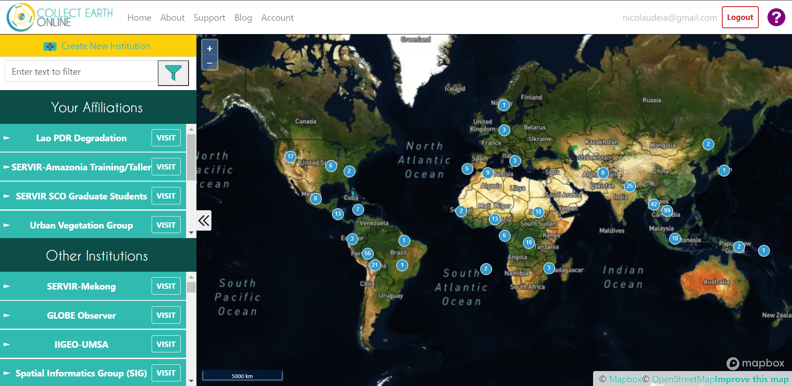
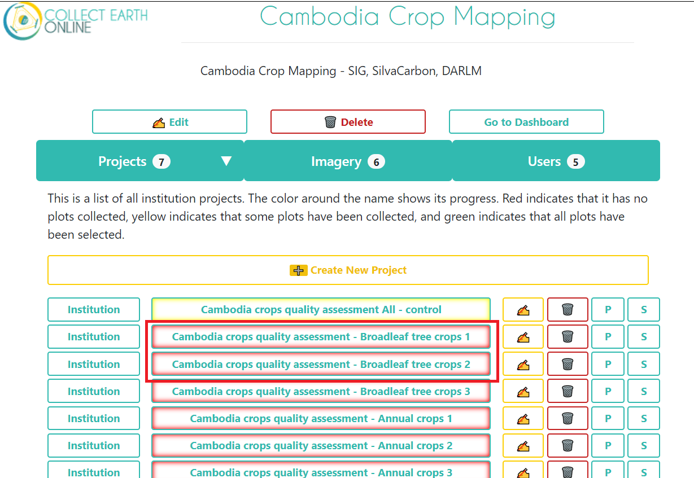
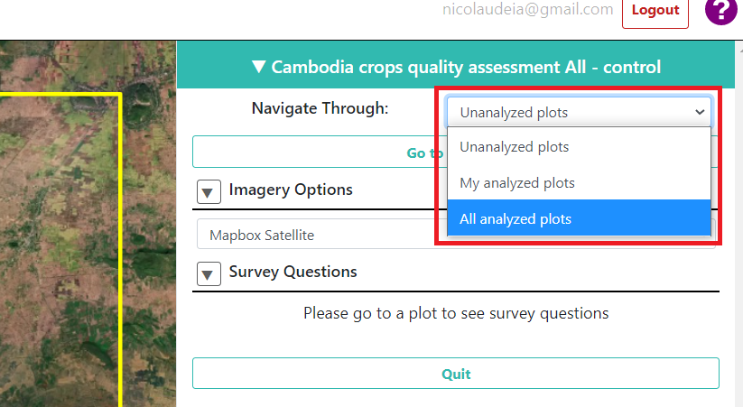

--------------------------
Additional data collection
--------------------------

You will collect more crop data - we aim to improve the performance of our model.

We will focus on broader classes, so don't worry about identifying specific crop types. These broader classes are:

* Broadleaf tree crops (Cashew, Mango, Longan, Rambutan, Durian, Orange)
* Palm crops (Coconut, Oil Palm, Other Palm including Banana and Date Palm)
* Shrub Crops (Pepper, Other Shrubs)
* Annual Crops (Cassava, Maize, Bean, Rice, Sugarcane, Vegetables)
* Other (Settlement, Water body, Rubber, Forest cover, Grassland, Shrubland, Other)

We have three projects in CEO, one for Tbong Khmun, one for Kampong Cham, and one for Kampong Sveu. Each project has six 4 by 4 km plots.

Getting Started
---------------

1. Login to `Collect Earth Online`_.

.. _Collect Earth Online: https://collect.earth

|

2. Go to the **Cambodia Crop Mapping** institution. You can look under "Your Affiliations" or search the institution using the search bar at the top. Click on **Visit** next to the institution.

.. figure:: images/visit.png

|

3. On the institution page, click on your project. Either "Cambodia crops additional data collection - Kampong Cham" or "Cambodia crops additional data collection - Kampong Sveu", or "Cambodia crops additional data collection - Tbong Khmun.

|

4. Go to the first plot to start the collection. 

.. figure:: images/firstplot2.png

|

Instructions for each plot
--------------------------

You will hand digitize polygons for the classes mentioned above. Every time you add a polygon using the proactive sampling tool, you will have to assign a class to it following a class scheme (number) that will be shown below. You will also have the option to add any relevant notes regarding that polygon.

+---------------------+--------+
|        Class        | Number |
+---------------------+--------+
| Broadleaf tree crop |    1   |
+---------------------+--------+
|      Palm crop      |    2   |
+---------------------+--------+
|      Shrub crop     |    3   |
+---------------------+--------+
|     Annual crop     |    4   |
+---------------------+--------+
|        Other        |    5   |
+---------------------+--------+

**Note**: In CEO, the plot boundary is considered a "plot", and the polyons to be drawn within the plot are considered the "sample".

Follow these instructions:

1. Pick a corner or specific area to start.  E.g.: top left corner, or a contiguous patch of same class.

.. figure:: images/topleftcorner.png

2. To start collecting the polygons, under "Survey Questions", click on the pencil icon below "Survey Questions".

.. figure:: images/surveyquestions.png

|

- The instructions to edit the sample will show up. Read the instructions to make sure you understand them.

.. figure:: images/pencilinstruc.png
  
|

3. Add a new polygon to the respective area by selecting "Polygon tool" and using your mouse to drawn it. Each click will place a vertice. 

.. figure:: images/pencil3.png

| 

|

.. figure:: images/edit2.png

|

**Note**: To move around the screen (pan) in the editing mode, make sure you do it by holding the click, otherwise, any click will place a new vertice. Also use the scroll wheel of your mouse to zoom in and out the screen - this will help you in editing mode.
  
.. figure:: images/gif3.gif

|

**Note**: If you need to fix a vertice after you finalized your polygon, you can hold ctrl and click a vertice to drag and fix it. Note that you can move vertices but you cannot add or remove vertices, for that, you will need to delete the entire polygon and start over.

.. figure:: images/gif2.gif

|

4. Once you are done with the first polygon, zoom out and find the centroid point of the plot. Hold CTRL and right-click the point to delete it.

|

|

5. Click on the question mark button (?) to go back to the survey question.

|

6. Click on the newly drawn polygon, add the class number to the answer, and then click the Save button right next to it.

.. figure:: images/addclass.png

|

7. Add any notes that might be relevant. If none, you can add a "0" and click Save next to it.

8. Go back to add more polygons and repeat the process.

.. figure:: images/surveyquestions.png

|

.. note::

  Make sure you use the basemap imagery available in your project:
   - Planet mosaics (Focus on 2019-12_2020_05 monthly mosaic)
   - UMD Tree canopy basemaps,
   - Bing Maps

|

9. Once you are done with all the polygons in this plot, Click Save to proceed to the next plot.

  
|

Make sure you cover all area of the plot, i.e., try to not leave any spaces between the polygons. You can start a new polygon by clicking on the vertice of an existing polygon (your mouse should be automatically "be attracted" to a vertice).

.. figure:: images/newp1.png
  
|

.. figure:: images/newp2.png
  
|

  
|

**Note**: If you wish to change or review previously analyzed plots, at the top of your project you can change the "Navigate Through" from "Unanalyzed plots" to "All analyzed plots". By clicking "Go to first plot", you will go through the plots you have already analyzed. You can change your answers but make sure you click Save at the bottom to save any changes.

  
|

.. figure:: images/analyzed2.png
  
|

Contact
-------

We know the process might not be entirely straightforward, so if you have any questions we will be happy to help! We have done this ourselves and understand the doubts that might arise. Please contact apnicolau@sig-gis.com, kdyson@sig-gis.com, and ktenneson@sig-gis.com for support.
