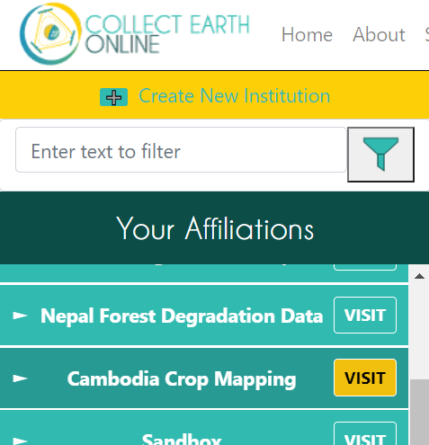
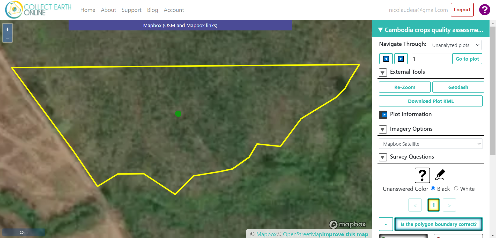
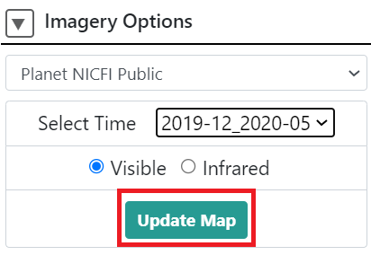
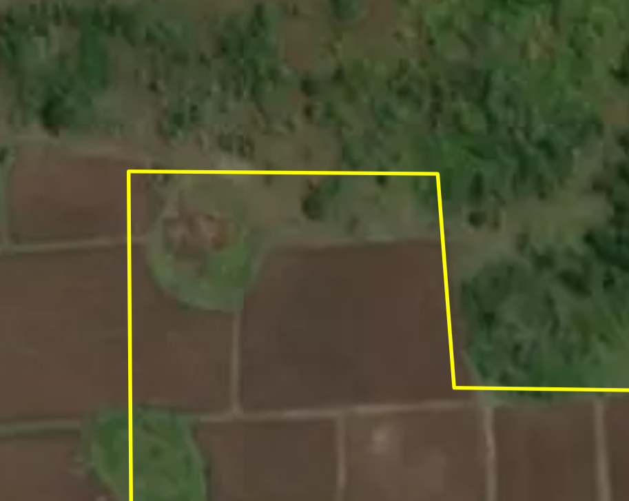

------------------------------
Cambodia crop plots assessment
------------------------------

You will be doing a quality assessment of the reference data collected that will serve as the input for the Cambodia crop mapping model. High quality data yields a high performance model.

Getting Started
---------------

1. Login to `Collect Earth Online`_.

.. _Collect Earth Online: https://collect.earth

.. figure:: images/ceo.png

|

2. Go to the ``Cambodia Crop Mapping`` institution. You can look under "Your Affiliations" or search the institution using the search bar at the top. Click on ``Visit`` next to the institution.

|

3. On the institution page, click on your project. Either "Cambodia crops quality assessment - Broadleaf tree crops 1" or "Cambodia crops quality assessment - Broadleaf tree crops 2".

.. figure:: images/project.png

|

4. Go to the first plot to start the assessment. 

.. figure:: images/firstplot.png

|

Instructions for each plot
--------------------------

You will analyze 320 broadleaf tree crops polygons (plots) that were hand digitized and answer a survey:

- Is the polygon boundary correct?
- Is this a broadleaf tree crop?

You will also have the option to add notes. E.g.: If you see the crop is not a broadleaf tree crop, you can add what crop type it is; or you can specify why you fixed the boundary of a plot (removed shrubland from the crop field).

**Note**: In CEO, the plot boundary is considered a "plot", and the points (or point, in this case) within the plot are considered the "sample".

Follow these instructions to answer the questions for each plot:

1. Expand the "Plot information" field to get information about the specific plot. You can check the crop type - this information will be useful to answer the second question of the survey.

|

|

2. Make sure to use the Planet NICFI data under "Imagery Options".

.. figure:: images/planet.png

|

- You should use the 2019-12_2020_05 monthly mosaic (But also use the MapBox Satellite, and UMD Tree Cover basemaps to assist you).

.. figure:: images/planet2.png

|

- Make sure you click on Update Map when changing the mosaic.

|

3. In order to answer the first question "Is the polygon boundary correct?": 

- Analyze if the polygon boundaries are mismatching the actual crop field boundaries. An example is below:

|

- Check if any shrubland or other type of land is within the crop field field. An example is below:

.. figure:: images/eg2.png

|

a. If the boundary is correct, answer Yes and jump to instruction 3. below.
b. If the boundary is not correct, you can use the new "proactive sampling" feature. Click on the pencil icon below "Survey Questions".

  .. figure:: images/pencil.png
  
|

  - The instructions to edit the sample will show up. Read the instructions to make sure you understand them.
  
  .. figure:: images/pencil2.png
    
|

  - Add a new polygon with the correct boundary by selecting "Polygon tool" and using your mouse to drawn it. Each click will place vertice. 
  
    **Note**: You cannot edit the existing plot since this tool is made to edit the sample (point) and not the plot (polygon)

  - Click on the question mark button (?) to go save changes and go back to the survey question.

  - Click on the point on the center and select No as the answer.
  
  - Click on the newly drawn polygon and select Yes as the answer.
  
4. Answer the following question "Is this broadleaf tree crop?". Look into the different Imagery options and select Yes, No, or Unsure. Don't worry about specifying which type of broadleaf tree crop it is.

5. Add notes to the box below "Describe issues if any". 

a. If you answered Yes to both questions, just add a zero or any character in the box to be able to proceed.
b. If you answered No to any of the questions, explain here why you answered No. (this is a good place to specify the crop type if you answered No to the second question).
c. Make sure you click Save.

6. Add a confidence level on the "Plot Confidence" feature. This is an overall assessment covering both questions. Just estimate how much confident you were (0-100%) in answering the questions including editing the polygon if you had to. 

7. Click Save to proceed to the next plot.

Contact
-------

We know the process might not be entirely straightforward, so if you have any questions we will be happy to help! We have done this ourselves and understand the doubts that might arise. Please contact apnicolau@sig-gis.com, kdyson@sig-gis.com, and ktenneson@sig-gis.com for support.
